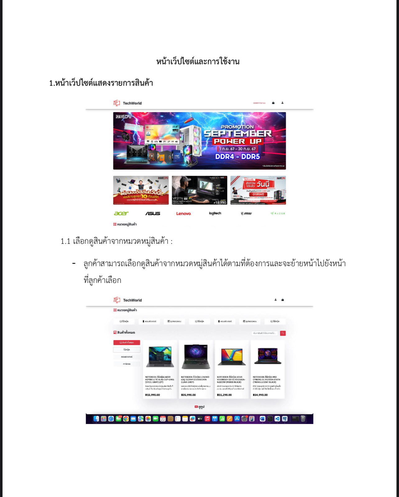
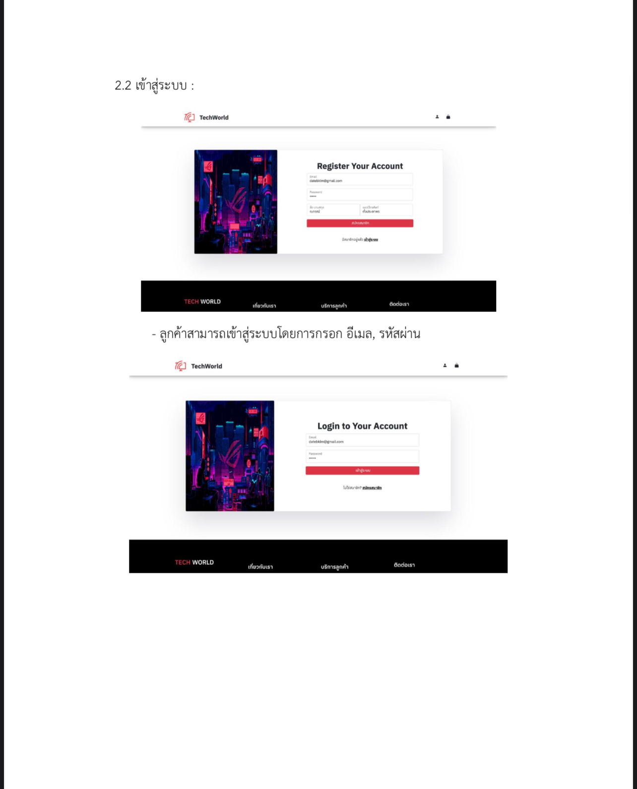
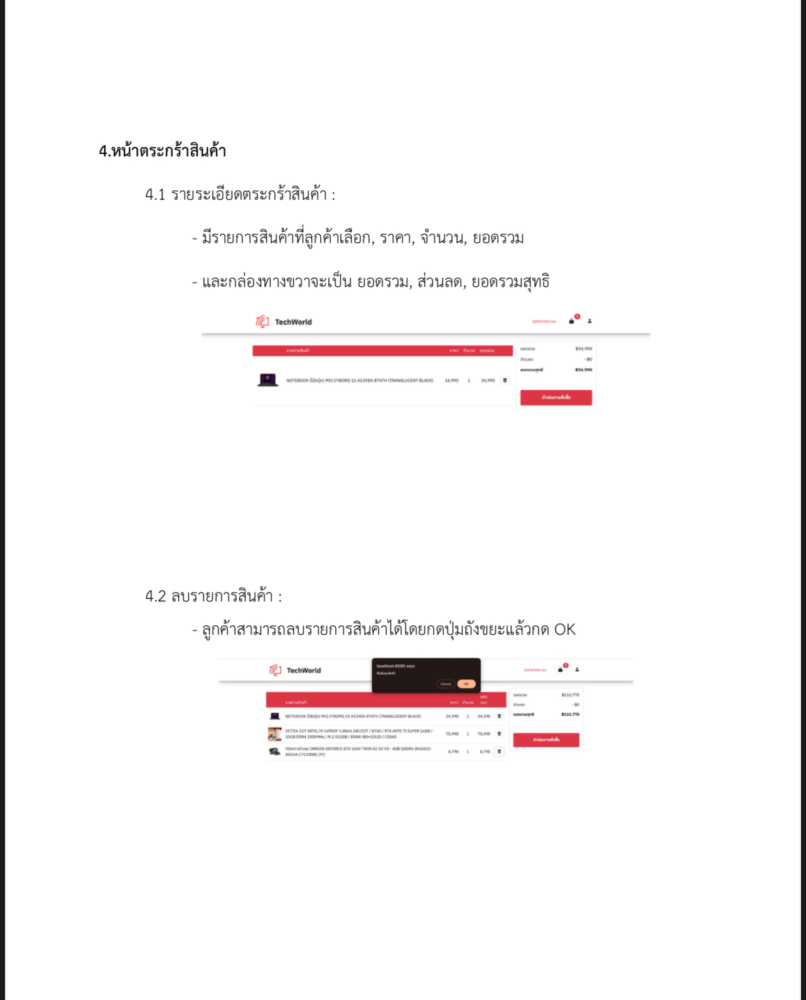
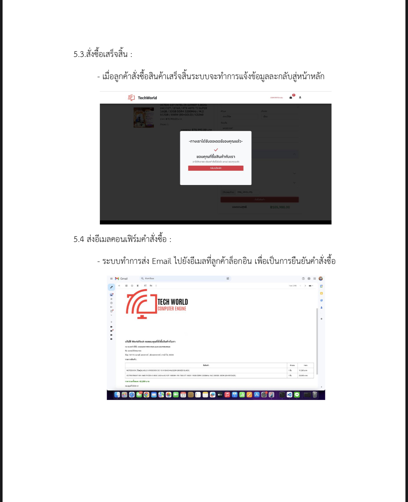
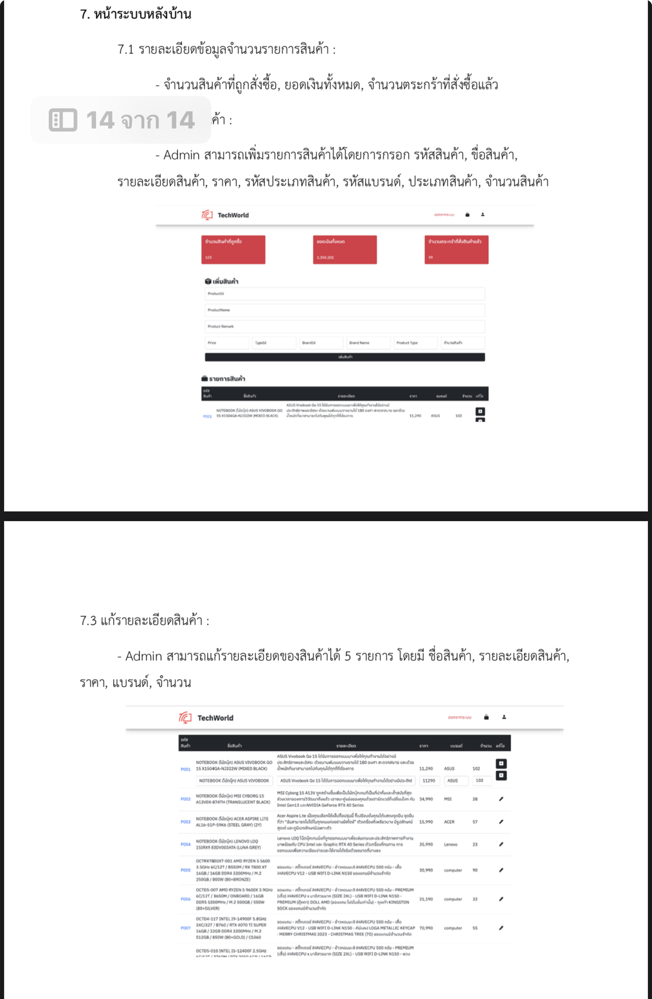
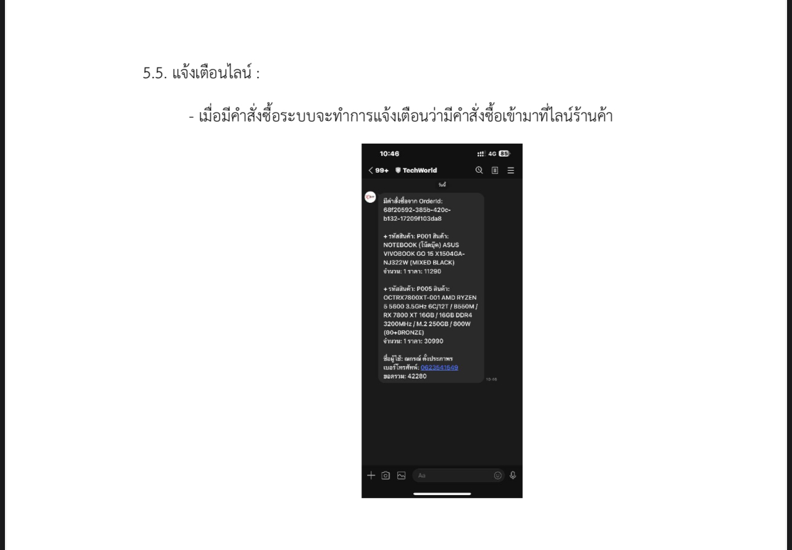

# ระบบสมัคร-ล็อคอิน และตะกร้าสินค้า - Vue.js + PostgreSQL  

---

## Overview  

พัฒนาแอปพลิเคชันระบบที่มีฟังก์ชันการสมัคร-ล็อคอิน เพิ่มสินค้าลงตะกร้า ซื้อสินค้า ระบบยืนยันคำสั่งซื้อผ่านอีเมล และแจ้งเตือนคำสั่งซื้อผ่าน LINE และระบบหลังบ้านในการเพิ่มสินค้าลบสินค้าและแก้ไขสินค้า CRUD

---

## Features  

### 1. ระบบสมัครสมาชิก  
- เก็บข้อมูลผู้สมัคร เช่น **Email**, **Password**, **ชื่อ-นามสกุล**, ลงฐานข้อมูล PostgreSQL  

### 2. ระบบล็อคอิน  
- ตรวจสอบข้อมูล **Email** และ **Password** จากฐานข้อมูล PostgreSQL  
- หากข้อมูลตรง ให้เข้าสู่ระบบ  
- หากข้อมูลไม่ตรง ปฏิเสธการล็อคอิน  

### 3. ระบบเพิ่มสินค้าลงตะกร้า  
- ผู้ใช้สามารถเลือกสินค้าจากระบบและเพิ่มลงตะกร้า  

### 4. ระบบซื้อสินค้า  
- ดำเนินการสั่งซื้อสินค้าผ่านระบบ

### 5. ระบบยืนยันคำสั่งซื้อผ่าน Email
- ส่ง **Email** เพื่อยืนยันการสั่งซื้อว่าท่านได้ซื้อสินค้าอะไรไปบ้าง ราคาเท่าไหร่และจำนวนสินค้า

### 6. ระบบแจ้งเตือนคำสั่งซื้อผ่าน LINE  
- แจ้งเตือนผู้ดูแลระบบผ่าน LINE Bot เมื่อมีคำสั่งซื้อ

### 6. ระบบหลังบ้าน CRUD  
- ADMIN สามารถแก้ไขสินค้า, เพิ่มสินค้า, ลบสินค้า ได้และ​ UI แสดงจำนวนสินค้าที่ขายไป, จำนวนเงินที่ได้รับ

---

## Technologies Used  

### Frontend  
- **Vue.js**  

### Backend  
- **Node.js**  

### Database  
- **PostgreSQL**  

### Email Service  
- สำหรับการยืนยันคำสั่งซื้อ  

### LINE Notify  
- ใช้สำหรับระบบแจ้งเตือนผ่าน LINE  

---

## Example UI Mockups  

### หน้าหลัก  
  

---

### หน้าล็อคอิน  
  

---

### หน้าเลือกสินค้าและเพิ่มลงตะกร้า  
  

---

### หน้ายืนยันคำสั่งซื้อ  
  

---

### หน้าหลังบ้านการเพิ่ม, ลบ, แก้ไขข้อมูล  
  

---

### ตัวอย่างการแจ่งเตือน LINE
  

---

